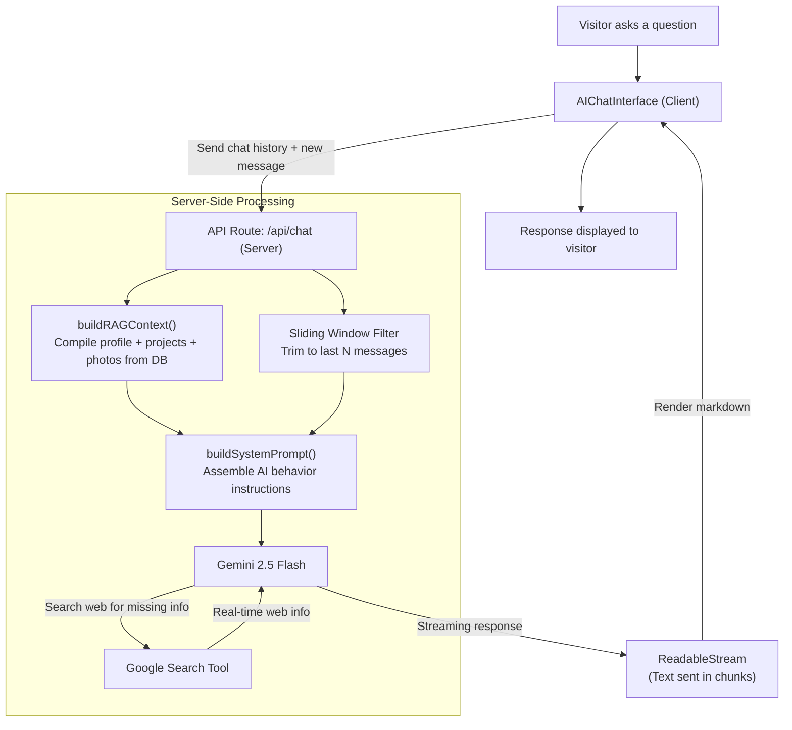

# 🌌 Interactive AI-Grounded Portfolio — Al Fitra Nur Ramadhani

<div align="center">

[](https://nextjs.org/)
[](https://react.dev/)
[](https://www.typescriptlang.org/)
[](https://tailwindcss.com/)
[](https://aistudio.google.com/)
[](https://supabase.com/)
[](https://playwright.dev/)
[](./docs/security/README.md)
[](https://semgrep.dev/)
[](https://github.com/gitleaks/gitleaks)

<p align="center">
  <strong>Personal portfolio website for Al Fitra Nur Ramadhani. A dynamic, high-performance web app integrating modern web technology, a centralized database, and Gemini-powered RAG AI with Google Search Grounding.</strong>
</p>

<p align="center">
  <a href="https://alfitranurr.vercel.app/" target="_blank" rel="noopener noreferrer">
    
  </a>
</p>

<p align="center">
  <a href="https://alfitranurr.vercel.app/"><strong>🌐 Live Website: alfitranurr.vercel.app</strong></a>
</p>

</div>

---

## 📖 Table of Contents

- [Overview](#-overview)
- [Key Features](#-key-features)
- [Tech Stack](#-tech-stack)
- [Project Architecture](#-project-architecture)
- [Getting Started](#-getting-started)
- [Environment Variables](#-environment-variables)
- [Database Setup](#-database-setup)
- [Admin Panel](#-admin-panel)
- [RAG AI Assistant](#-rag-ai-assistant)
- [Testing](#-testing)
- [Security](#-security)
- [Developer Profile](#-developer-profile)
- [License](#-license)

---

## 🚀 Overview

This is not a static portfolio page — it is a full-stack web application that demonstrates real software engineering and data science capabilities. All content (projects, experience, education, certificates, photos, skills) is managed in real-time through a protected admin dashboard backed by a Supabase database, and fed into a Gemini-powered RAG chatbot that lets visitors interactively explore the portfolio.

### Highlights

- **Dynamic content management** — full CRUD admin panel for every data type, no code edits needed to update content.
- **AI assistant with RAG** — visitors ask questions about the portfolio; the AI answers using database context plus real-time Google Search grounding.
- **Visitor analytics** — page views and unique visitor tracking with a dashboard chart.
- **Glassmorphism UI** — polished dark/light theme with glassmorphic cards, Framer Motion animations, and an initial loader.
- **ISR + force-dynamic hybrid** — public pages cached for performance (`revalidate = 3600`), admin pages always fresh (`force-dynamic`), with a one-click cache reset button.
- **Mock mode fallback** — the app runs without Supabase/Gemini credentials, falling back to in-memory mock data and cookie-based persistence. Ideal for local development and testing.
- **Security hardening** — CSP headers, rate limiting, XSS prevention, prompt injection guardrails, IP anonymization, pre-commit secret scanning, and SAST/SCA in CI. Full audit in [`docs/security/`](./docs/security/).

---

## ✨ Key Features

### 🧠 RAG AI Assistant with Google Search Grounding
The **"Ask AI"** feature is a virtual assistant that answers questions about Al Fitra's career and achievements using **RAG (Retrieval-Augmented Generation)**.

- **Web search grounding** — integrated with Google Search via the official `@google/genai` SDK. When local portfolio data lacks detail, the AI dynamically searches the web.
- **Smart query reformulation** — the AI rewrites relative pronouns (e.g. *"nya"*, *"dia"*) into the full name *"Al Fitra Nur Ramadhani"* before querying Google Search to ensure relevance.
- **Token efficiency (sliding window)** — the backend trims chat history to the last N messages (configurable, default 10) before sending to Gemini, saving TPM quota while the client shows the full history.
- **Configurable** — model name, temperature, max history, and search grounding can be toggled from the admin panel (`/admin/ai-settings`).

### 💎 Premium UI/UX
- **Dark & light theme** — theme toggle persisted via `next-themes`, default dark.
- **Glassmorphism** — translucent glass cards with backdrop blur.
- **Framer Motion** — micro-interactions, layout animations, and `AnimatePresence` page transitions.
- **Responsive** — mobile-first layout with collapsible sidebars on both user and admin views.
- **Initial loader** — branded loading screen on first paint.

### 🛡️ Protected Admin Panel
- **CRUD management** — full create/read/update/delete for projects, experience, education, certificates, skills, and photos.
- **Drag-and-drop ordering** — pinned/featured project ordering and skill levels.
- **Image uploads** — file upload to Supabase Storage (`portfolio-assets` bucket) with Google Drive URL support via `getDirectImageUrl()`.
- **Visitor analytics** — total views, unique visitors, today's stats, and a monthly traffic chart.
- **One-click cache reset** — force-revalidate all ISR-cached public pages from the dashboard.
- **Reset stats** — permanently clear all visitor analytics data.
- **Auth** — Supabase Auth session protected via middleware; single-admin lock (first signup only).

---

## 🛠️ Tech Stack

| Layer | Technology |
|-------|-----------|
| Framework | Next.js 16.2 (App Router) |
| UI | React 19.2, Tailwind CSS 4, Framer Motion, lucide-react |
| Language | TypeScript 5 |
| Database & Auth | Supabase (PostgreSQL, Storage, Auth) |
| AI | Google Gemini 2.5 Flash (`@google/genai`) |
| Markdown | react-markdown |
| Testing | Playwright 1.62 |
| Linting | ESLint 9 (flat config) |
| Security | Semgrep SAST, Gitleaks, Promptfoo LLM red-team, Pre-commit hooks |
| Deployment | Vercel |

---

## 📐 Project Architecture

```text
portfolio-v3/
├── src/
│   ├── app/                        # Next.js App Router
│   │   ├── admin/                  # Protected admin panel
│   │   │   ├── actions/            # Server actions (per-domain modules)
│   │   │   │   ├── _shared.ts      # hasSupabaseConfig(), requireAdmin()
│   │   │   │   ├── analytics.ts    # visitor stats + reset action
│   │   │   │   ├── cache.ts        # revalidate public pages action
│   │   │   │   ├── photos.ts       # photo CRUD
│   │   │   │   ├── projects.ts     # project CRUD
│   │   │   │   └── ...              # education, experience, etc.
│   │   │   ├── ai-settings/         # AI config page
│   │   │   ├── photos/             # Photos gallery manager
│   │   │   ├── projects/           # Projects manager
│   │   │   └── page.tsx            # Dashboard (messages + stats)
│   │   ├── api/chat/               # Gemini RAG streaming endpoint
│   │   ├── ask-ai/                 # AI chat interface page
│   │   ├── projects/               # Public projects showcase
│   │   ├── certificates/            # Public certificates page
│   │   ├── education/              # Public education timeline
│   │   ├── experience/             # Public experience timeline
│   │   ├── contact/                # Contact form
│   │   └── login/                  # Admin auth
│   ├── components/
│   │   ├── admin/                  # Admin CRUD components (per domain)
│   │   ├── ui/                     # Shared UI (BlurImage, etc.)
│   │   ├── sidebar.tsx             # Public sidebar (collapsible)
│   │   ├── admin-sidebar.tsx       # Admin sidebar (collapsible)
│   │   └── main-layout-container.tsx # Responsive layout wrapper
│   ├── lib/
│   │   ├── data-service.ts         # Data fetchers (Supabase + mock fallback)
│   │   ├── rag-context.ts          # RAG context builder + system prompt
│   │   ├── ai-service.ts           # AI settings + chat log persistence
│   │   ├── types.ts                # TypeScript interfaces
│   │   └── supabase/               # Supabase client + middleware
│   └── proxy.ts                    # Middleware entry (auth + route protection)
├── schema.sql                      # Supabase database initialization script
├── playwright.config.ts            # Playwright test config (mock mode)
├── tests/                          # Integration tests
├── docs/security/                  # Security audit reports (14 files)
├── .github/workflows/              # CI: security.yml + llm-redteam.yml
├── .pre-commit-config.yaml         # Pre-commit hooks (gitleaks, eslint)
├── promptfooconfig.yaml            # LLM red-team config
└── SECURITY_SKILLS_PROMPT.md       # 114-skill mapping to attack surface
```

### Data Flow: RAG Chatbot



---

## 🎯 Getting Started

### Prerequisites

- Node.js 18+ (tested on Node 20)
- npm (or compatible package manager)
- A Supabase project (optional — app runs in mock mode without it)
- A Google Gemini API key (optional — only for the AI feature)

### Installation

```bash
# Clone the repository
git clone https://github.com/alfitranurr/portfolio-v3.git
cd portfolio-v3

# Install dependencies
npm install

# Copy environment template
cp .env.example .env.local

# Start the dev server
npm run dev
```

The app will be available at `http://localhost:3000`.

> **Note:** Without `.env.local` values, the app runs in **mock mode** — it uses in-memory mock data and cookie-based persistence. Admin login uses mock credentials (`admin@example.com` / `admin-password-here` by default).

---

## 🔐 Environment Variables

Configure these in `.env.local` (see `.env.example`):

| Variable | Required | Description |
|----------|----------|-------------|
| `NEXT_PUBLIC_SUPABASE_URL` | No | Your Supabase project URL. Omit to run in mock mode. |
| `NEXT_PUBLIC_SUPABASE_ANON_KEY` | No | Your Supabase anon public key. Omit to run in mock mode. |
| `GEMINI_API_KEY` | No | Google Gemini API key (get one free at [aistudio.google.com/apikey](https://aistudio.google.com/apikey)). Required for the AI chat feature. |
| `ADMIN_MOCK_EMAIL` | No | Mock admin email (used only when Supabase is not configured). |
| `ADMIN_MOCK_PASSWORD` | No | Mock admin password (used only when Supabase is not configured). |

> **Security:** `.env.local` is gitignored and never committed. All secrets stay server-side except `NEXT_PUBLIC_*` vars (required client-side by Supabase SDK).

---

## 🗄️ Database Setup

This project uses Supabase as its database, auth, and storage provider.

### 1. Create a Supabase project
Go to [supabase.com](https://supabase.com), create a new project, and copy your Project URL and anon key into `.env.local`.

### 2. Run the schema script
Open the Supabase SQL Editor and paste the entire contents of [`schema.sql`](./schema.sql). This creates all 12 tables, RLS policies, the storage bucket, and the single-admin lock trigger. The script is **idempotent** — safe to run multiple times.

**Tables created:**
| Table | Purpose |
|-------|---------|
| `profiles` | Hero / about-me data |
| `projects` | Portfolio projects |
| `experiences` | Work history |
| `education` | Education timeline |
| `certificates` | Certifications & awards |
| `skills` | Tech stack with proficiency levels |
| `photos` | Moment recap gallery |
| `messages` | Contact form submissions |
| `page_views` | Visitor analytics |
| `ai_settings` | AI configuration (model, temperature, etc.) |
| `ai_chat_logs` | Token usage audit log |

### 3. Create the admin account
Sign up at `/login` — the first signup creates the admin account and profile row. Subsequent signups are **blocked** by a database trigger (`handle_new_user`) to enforce single-admin access.

### 4. Storage bucket
The `portfolio-assets` bucket is created as **public** by the schema script for image uploads (logos, covers, photos).

---

## 🛠️ Admin Panel

Access the admin at `/admin` (redirects to `/login` if unauthenticated).

| Route | Function |
|-------|----------|
| `/admin` | Dashboard — messages inbox, visitor stats, monthly traffic chart |
| `/admin/profile` | Edit hero/about-me/profile data + avatar/logo upload |
| `/admin/projects` | Project CRUD with drag-and-drop featured ordering |
| `/admin/experience` | Experience CRUD |
| `/admin/education` | Education CRUD |
| `/admin/certificates` | Certificate CRUD |
| `/admin/skills` | Tech stack CRUD with proficiency levels |
| `/admin/photos` | Moment recap gallery CRUD |
| `/admin/ai-settings` | AI model config (model name, temperature, max history, search grounding) |

### Admin toolbar actions
- **Reset Cache** — force-revalidate all ISR-cached public pages so visitor view reflects latest DB changes immediately.
- **Reset Stats** — permanently delete all `page_views` records and reset visitor analytics to 0.
- **Sidebar collapse** — toggle the admin sidebar to icon-only mode for full-width layout.

---

## 🧪 Testing

Tests run via **Playwright** and cover both API-level and UI-level integration.

```bash
npm run test          # Run all tests (spins up dev server in mock mode on port 3111)
npm run test:ui       # Interactive Playwright UI mode
npm run test:headed   # Run tests in a visible browser
npm run test:report   # Show the last test report HTML
```

The Playwright `webServer` forces **mock mode** by clearing `NEXT_PUBLIC_SUPABASE_URL`, `NEXT_PUBLIC_SUPABASE_ANON_KEY`, and `GEMINI_API_KEY` env vars (see `playwright.config.ts`). This exercises the `hasSupabaseConfig() === false` fallback branches without real credentials.

**Mock admin credentials in tests:** `admin@portfolio.test` / `test-password-123`

### Linting & Type Checking

```bash
npm run lint          # ESLint (flat config)
npx tsc --noEmit      # TypeScript type check
npm run build         # Production build (runs type check + build)
```

---

## 🛡️ Security

This project has undergone a comprehensive security audit using the [Anthropic Cybersecurity Skills](https://github.com/mukul975/Anthropic-Cybersecurity-Skills) library (818 skills, 34 domains). **18 security items** were audited across 10 skills — all fixes applied and verified.

> 📄 **Full audit report:** [`docs/security/README.md`](./docs/security/README.md)
> 📋 **Skill mapping:** [`SECURITY_SKILLS_PROMPT.md`](./SECURITY_SKILLS_PROMPT.md) (114 curated skills → attack surface)

### Audit Summary

| Metric | Value |
|--------|-------|
| Items audited | 18 |
| Fixes applied | 8 code fixes + 10 config/docs |
| Live tests | Prompt injection ✅ (2/2 blocked) · Rate limit ✅ (429 after 10/min) |
| Secret scan | Git history + source code ✅ clean |
| RLS policies | 12/12 Supabase tables ✅ protected |
| Lint / Build / Test | ✅ PASS / ✅ PASS / 23/23 ✅ PASS |

### Security Measures Implemented

#### Code-Level Fixes (7 files modified)

| Fix | File | Detail |
|-----|------|--------|
| **AI Chat hardening** | `src/app/api/chat/route.ts` | Input validation (50 msgs, 4000 chars), rate limiting (10 req/min per-IP), output guardrail (system prompt leak block), error sanitization, IP anonymization |
| **XSS prevention** | `src/app/projects/[id]/page.tsx` | `sanitizeEmbedCode()` — iframe-only allowlist (Tableau, YouTube, Plotly), event handler stripping, `sandbox` attribute |
| **Access control** | `src/app/admin/actions/ai.ts` | Added `requireAdmin()` to `getAISettingsAction()` |
| **Cookie hardening** | `src/app/login/actions.ts` | `httpOnly`, `sameSite: strict`, `maxAge: 24h` for mock session cookie |
| **File upload validation** | `src/app/admin/actions/uploads.ts` | Type allowlist (JPG/PNG/WebP/GIF/SVG), 5MB limit |
| **IP anonymization** | `src/lib/ai-service.ts` | `anonymizeIP()` — IPv4 last octet zeroed, IPv6 truncated (GDPR/UU PDP compliance) |
| **Security headers + CSP** | `next.config.ts` | CSP, X-Frame-Options, HSTS, X-Content-Type-Options, Referrer-Policy, Permissions-Policy, CORS same-origin |

#### CI/CD & Tooling (4 new files)

| File | Purpose |
|------|---------|
| `.github/workflows/security.yml` | SAST (Semgrep) + SCA (npm audit) + Gitleaks secret scan + ESLint — runs on push, PR, and weekly |
| `.github/workflows/llm-redteam.yml` | Promptfoo LLM red-team regression — runs on chat/RAG changes |
| `.pre-commit-config.yaml` | Pre-commit hooks: gitleaks, eslint, file checks, private key detection |
| `promptfooconfig.yaml` | Promptfoo red-team config (prompt extraction, injection, RAG poisoning, jailbreak) |

#### Documentation (14 reports)

All reports in `docs/security/`:

| Report | Scope |
|--------|-------|
| `README.md` | Comprehensive final report (start here) |
| `SECURITY_AUDIT_CHAT_API.md` | /api/chat hardening details |
| `SECURITY_AUDIT_PROMPT_LEAKAGE.md` | Prompt injection live test results |
| `SECURITY_AUDIT_SECRET_SCANNING.md` | Secret scan results |
| `SECURITY_AUDIT_SSRF.md` | SSRF + upload validation audit |
| `SECURITY_AUDIT_XSS.md` | XSS fix details (sanitizeEmbedCode) |
| `SECURITY_AUDIT_ACCESS_CONTROL.md` | 25+ admin actions access control audit |
| `SECURITY_AUDIT_JWT.md` | Supabase JWT security |
| `SECURITY_AUDIT_HEADERS_CORS.md` | Security headers + CORS + CSP |
| `SECURITY_THREAT_MODEL.md` | STRIDE threat model + attack trees |
| `SECURITY_HSTS_PRELOAD.md` | HSTS preload submission guide |
| `SECURITY_AUDIT_BATCH3.md` | CI/CD + threat model batch report |
| `SECURITY_AUDIT_SUMMARY.md` | Batch 1-2 summary |
| `SECURITY_AUDIT_STATUS.md` | Final status checklist |

### Enabling Pre-Commit Hooks

```bash
pip install pre-commit
pre-commit install
```

This activates gitleaks secret scanning, ESLint, and file validation on every commit.

### STRIDE Threat Model

22 threats identified across 6 STRIDE categories — **all mitigated**:

| Category | Threats | Status |
|----------|--------|--------|
| Spoofing | 3 | ✅ Mitigated |
| Tampering | 5 | ✅ Mitigated |
| Repudiation | 2 | ✅ Mitigated |
| Information Disclosure | 5 | ✅ Mitigated |
| Denial of Service | 4 | ✅ Mitigated |
| Elevation of Privilege | 3 | ✅ Mitigated |

See [`docs/security/SECURITY_THREAT_MODEL.md`](./docs/security/SECURITY_THREAT_MODEL.md) for full analysis and attack trees.

---

## 👤 Developer Profile

<div align="left">

**Al Fitra Nur Ramadhani**
*Data Science Professional*

- **Education:** Universitas Muhammadiyah Malang (UMM)
- **Expertise:** Machine Learning, Deep Learning, Natural Language Processing, Data Analytics, Python, SQL, Tableau, PowerBI
- **Professional Links:**
  - 💼 [LinkedIn](https://www.linkedin.com/in/al-fitra-nur-ramadhani/)
  - 🐙 [GitHub](https://github.com/alfitranurr)
  - 📸 [Instagram](https://www.instagram.com/rmdhani_ii)

</div>

---

## 📄 License

© 2026 Al Fitra Nur Ramadhani. All rights reserved.

This project is proprietary. The source code is shared for portfolio demonstration purposes. Unauthorized copying, redistribution, or commercial use is not permitted without explicit consent.
