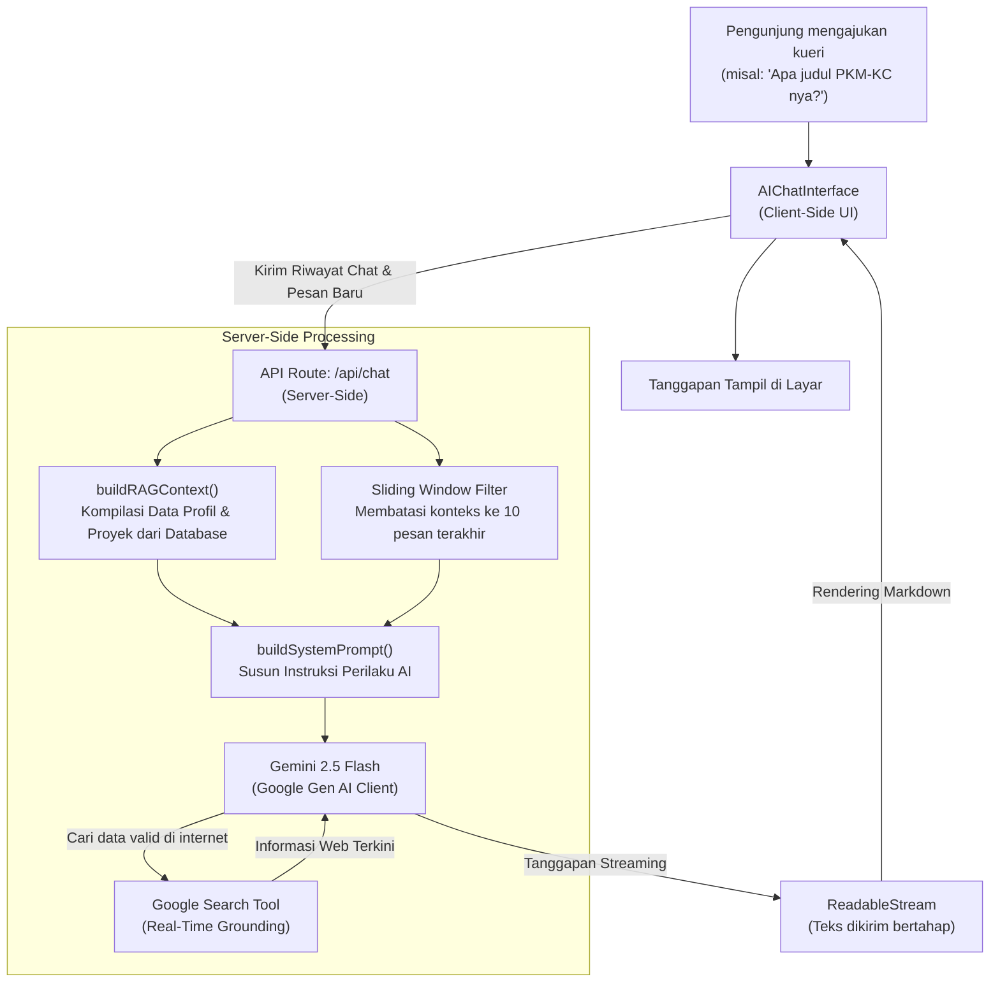

# 🌌 Interactive AI-Grounded Portfolio — Al Fitra Nur Ramadhani

<div align="center">
  
  [](https://nextjs.org/)
  [](https://react.dev/)
  [](https://www.typescriptlang.org/)
  [](https://tailwindcss.com/)
  [](https://aistudio.google.com/)
  [](https://supabase.com/)

  <p align="center">
    <strong>Repositori resmi untuk website portfolio pribadi milik Al Fitra Nur Ramadhani. Mengintegrasikan teknologi Web modern, arsitektur database terpusat, dan kecerdasan buatan Gemini API yang diperkuat oleh Google Search Grounding.</strong>
  </p>

  <p align="center">
    <a href="https://alfitranurr.vercel.app/" target="_blank" rel="noopener noreferrer">
      
    </a>
  </p>

  <p align="center">
    <a href="https://alfitranurr.vercel.app/"><strong>🌐 Live Website: alfitranurr.vercel.app</strong></a>
  </p>

</div>

---

## 🚀 Pengenalan Proyek

Situs ini dibangun sebagai pembuktian kemampuan rekayasa perangkat lunak (*software engineering*) dan analisis data (*data science*) secara nyata. **Portfolio V3** bukan sekadar halaman statis biasa, melainkan aplikasi web dinamis dengan performa tinggi yang memiliki manajemen konten mandiri (Admin Dashboard) dan fitur chat interaktif berbasis kecerdasan buatan.

Semua data utama (pengalaman kerja, proyek, pendidikan, dan sertifikasi) dikelola secara *real-time* melalui basis data terpusat, dan diumpankan ke dalam asisten AI untuk memberikan pengalaman eksplorasi portofolio yang interaktif bagi perekrut dan kolaborator.

---

## ✨ Sorotan Fitur & Teknologi

### 🧠 1. RAG AI Assistant dengan Google Search Grounding
Fitur **"Ask AI"** adalah asisten virtual cerdas yang mampu menjawab semua pertanyaan tentang perjalanan karier dan pencapaian Al Fitra menggunakan metode **RAG (Retrieval-Augmented Generation)**.
* **Grounding Pencarian Web:** Terintegrasi dengan Google Search melalui SDK `@google/genai` resmi. Ketika data lokal portfolio tidak memuat detail (misalnya susunan tim PKM-KC atau liputan berita eksternal), AI secara dinamis mencari datanya di internet.
* **Formulasi Kueri Cerdas:** AI dilatih menulis ulang kata ganti orang relatif (seperti *"nya"*, *"dia"*, *"proyeknya"*) menjadi nama lengkap *"Al Fitra Nur Ramadhani"* sebelum mengirimkan kueri pencarian ke Google Search guna memastikan relevansi pencarian.
* **Efisiensi Token (Sliding Window):** Back-end memotong riwayat obrolan hanya mengirim **10 pesan terakhir** ke Gemini API untuk menghemat kuota Token Per Menit (TPM), sementara pengguna di sisi antarmuka tetap melihat riwayat chat secara utuh.

### 💎 2. Antarmuka UI/UX Premium (Glassmorphism)
* **Desain Dark Theme:** Estetika antarmuka bernuansa gelap dengan efek kartu kaca transparan (*glassmorphic card*) yang modern dan futuristik.
* **Interaktivitas Halus:** Menggunakan **Framer Motion** untuk animasi micro-interactions, meminimalkan pergeseran tata letak (*layout shift*), serta transisi halaman bebas glitch dengan `AnimatePresence`.
* **Pemuatan Instan:** Dilengkapi indikator pemuatan progress bar dinamis di bagian atas layar menggunakan `nextjs-toploader`.

### 🛡️ 3. Panel Manajemen Konten Terproteksi (Admin Panel)
* **Manajemen CRUD Mandiri:** Halaman admin khusus yang aman untuk memperbarui, menghapus, atau menambah entri proyek baru, riwayat pekerjaan, riwayat sekolah, dan sertifikasi.
* **Arsitektur Database:** Menggunakan **Supabase Database** dengan sinkronisasi instan.
* **Sistem Keamanan:** Mengamankan semua kunci API dan kredensial sensitif dengan menggunakan environment variables lokal (`.env.local`) yang tidak terindeks oleh Git.

---

## 📐 Arsitektur Aliran Data RAG Chatbot

Mermaid diagram di bawah menunjukkan bagaimana kueri pengunjung diproses secara aman dan respons disajikan secara streaming:



---

## 📂 Struktur Arsitektur Codebase

```text
src/
├── app/                    # Next.js App Router (Routing Halaman & API)
│   ├── admin/              # Panel Kontrol untuk Modifikasi Data Portfolio
│   │   └── page.tsx        # Dashboard CRUD admin
│   ├── api/chat/           # Streaming handler untuk Gemini RAG API
│   │   └── route.ts        # Logika utama chat & integrasi Google Search
│   ├── ask-ai/             # Halaman antarmuka asisten AI
│   ├── projects/           # Halaman showcase proyek Al Fitra
│   └── login/              # Sistem autentikasi admin
├── components/             # Komponen UI (Sidebar, Terminal-like AI Chat UI)
├── lib/                    # Logika Bisnis & Utilitas Sistem
│   ├── rag-context.ts      # Konstruktor prompt RAG & aturan formulasi kueri
│   ├── supabase/           # Konfigurasi koneksi client database
│   └── data-service.ts     # Penanganan data (mengambil dari DB atau file cadangan)
└── globals.css             # Desain global, variabel warna HSL, & animasi
```

---

## 👤 Developer Profile

<div align="left">
  
**Al Fitra Nur Ramadhani**  
*Data Science Professional*  

* **Pendidikan:** Universitas Muhammadiyah Malang (UMM)
* **Keahlian:** Machine Learning, Deep Learning, Natural Language Processing, Data Analytics, Python, SQL, Tableau, PowerBI.
* **Kontak Profesional:**
  * 💼 [LinkedIn Profile](https://www.linkedin.com/in/al-fitra-nur-ramadhani/)
  * 🐙 [GitHub Profile](https://github.com/alfitranurr)
  * 📸 [Instagram Profile](https://www.instagram.com/rmdhani_ii)

---
<p align="center">
  Hak Cipta &copy; 2026 Al Fitra Nur Ramadhani. Seluruh Hak Cipta Dilindungi Undang-Undang.
</p>
</div>
